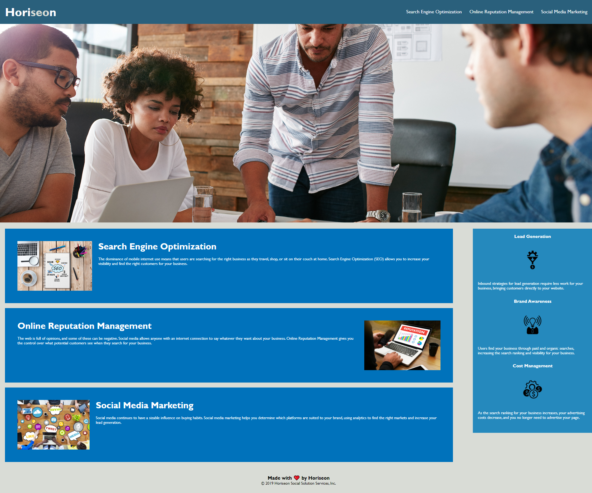

# module1challengehoriseon
## **Module 1 Challenge-HTML, CSS, and Git: Code Refactor**

### **Description:**

For the first challenge, I had to refactor code to make sure that it follows accessibility standards and follows a semantic structure as well.

**I did the following by:**
- Putting the selectors in order of importance (eg. univeral, element , class)
- Ordering all the selectors in alphabetical order
- Using alt attributes and key image words
- Consolidating lines of repetitive code and eliminated unnessary selectors
-Adding comments with what was revised
-Changing the div tag and used semantic structure and elements throughout the code

### **Mockup**

The following image shows the web application's appearance and functionality:

### **Link of deployed application:**

https://thivsiv28.github.io/module1challengehoriseon/

